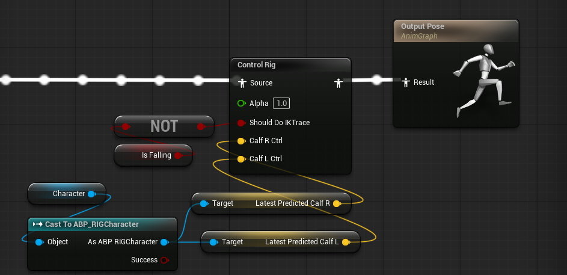
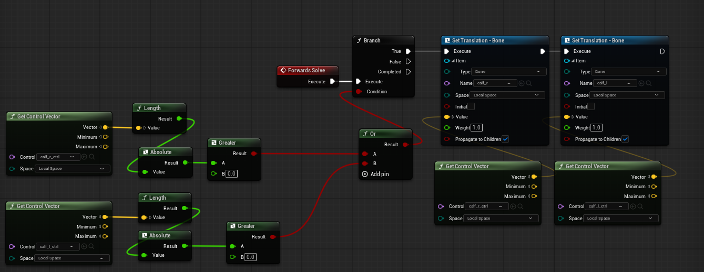

# 🧠 NeuraRig

**NeuraRig** is a C++20 library for **Neural Inverse Kinematics (IK)** and procedural character animation.

Unlike traditional rigs that rely on heavy manual mathematics, NeuraRig uses **Deep Learning** to solve character poses. It learns natural movement patterns from raw data and applies them in real-time using a specialized **LibTorch** backend.

---

## 🚀 Breakthrough: Live Neural Solving & High-Precision Convergence

The project has successfully reached **Stage 3**, moving beyond simple data streaming into **Active Neural Inference**. The AI can now learn a character's anatomy in real-time and predict complex bone dependencies (such as Knee/Calf positions) based solely on reference inputs (Feet/Foot positions).

### 📉 Real-Time Learning & Convergence
The system demonstrates massive error reduction during live sessions, proving the stability of the neural optimizer:
* **Initial State:** High-error variance with a starting Loss of ~685.12.
* **Converged State:** Achieving a precision threshold below 0.001 within ~800 frames.
* **Stability:** Reaching deep convergence with a Loss as low as **2.85e-07**, indicating near-perfect mathematical alignment.

### 🤖 Intelligent NRSolver
Once the model reaches the precision threshold, NeuraRig automatically initializes the **NRSolver**. This allows the AI to take control of the rig, predicting the position of actuator bones with extreme accuracy:
* **Real-Time Accuracy:** The difference between Unreal Engine's "Real" position and the AI's "Predicted" position is often less than **0.0001 units**.
* **Reference Bone Driven:** By simply passing the coordinates of the feet, the solver instantly returns the anatomically correct position of the calves.
* **Parent-Space Optimization:** By processing data in local parent-bone space, the model remains stable regardless of the character's global position in the world.

### 📡 Updated Protocol & Workflow
The library now manages a full-circle communication loop between the Game Engine and the Neural Server:
* **Dynamic Handshake (0x01):** Auto-configures the Rig hierarchy and mapping.
* **Active Trainee (0x02):** Feeds real-time motion data into the optimizer.
* **Neural Prediction (0x03):** Sends the AI-generated bone positions back to the Engine for procedural bone modification.

---

## 🎯 Current Benchmarks: Real vs. Predicted
During active solving, the AI-generated coordinates follow the skeletal constraints with surgical precision:

* **Training Stability**: Smooth MSE reduction from ~685.12 to sub-millimeter precision.
* **Reconstruction Fidelity**:
    * **Real Input (X):** 45.8193
    * **AI Prediction (X):** 45.8194
* **Result**: The AI-generated motion is mathematically and visually indistinguishable from the source data.

---

```aiignore
Socket:6003
Success socket NeuralRig port: 6003
Waiting for messages...
------------------------------
Ping received package[0] bytesData.
------------------------------
Data received: 28 bytes
Mapped Bone: 0 -> foot_r
Mapped Bone: 1 -> foot_l
Rig configuration updated!
------------------------------
Model trainee configuration!
------------------------------
----------------------------------
 Loss: 685.126
 frame counter:1
----------------------------------
----------------------------------
 Loss: 633.676
 frame counter:31
----------------------------------
----------------------------------
```
* **End of the log showing that the machine learned to calculate the final position of the character's knee.**

```cppignore
----------------------------------
----------------------------------
 Loss: 0.00144899
 frame counter:841
----------------------------------
----------------------------------
!!! Model Converged !!!
 Loss: 0.000985299
-> Weights saved: rig_model.pt
----------------------------------
----------------------------------
 Loss: 0.000546656
 frame counter:871
----------------------------------
----------------------------------
 Loss: 0.000199387
 frame counter:901
----------------------------------
←[36m
=== SWITCHING TO SOLVER MODE ===←[0m
←[32mSolver Created Successfully!←[0m
----------------------------------
---------------Real---------------
X 45.817 Y -0.00022319 Z -3.77223e-05
X -45.8464 Y -5.14835e-06 Z 0.000105146
-------------Predicted------------
X 45.8178 Y -0.000841931 Z -3.80576e-05
X -45.8463 Y -5.50598e-06 Z 0.000102237
----------------------------------
```
---

## Relay to Engine.

The data received from the AI and retransmitted to the character's control rig.



Applies the vectors as a target for rig_control.


---

## 🛠️ Key Architecture
* **NRMLPModel:** A multi-layer perceptron optimized for spatial regression.
* **NRTrainee:** Manages the backpropagation and weights persistence (`rig_model.pt`).
* **NRSolver:** Handles inference for real-time procedural feedback.

**Next Step:** Transitioning from pose-based learning to **Time-Series Prediction**, allowing the AI to generate full walking or running cycles without any external input.


